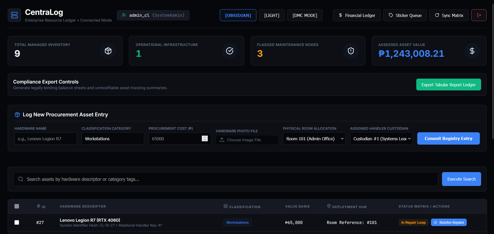

# CentraLog

> **Executive Summary:** CentraLog resolves institutional asset control challenges by synthesizing physical chain-of-custody tracking with dynamic financial accounting. Designed as a decoupled .NET 8 Web API and React 19 SPA, the platform automates preventative maintenance sweeps, multi-custodian bulk relocations, and real-time asset depreciation ledger calculations across enterprise IT fleets.

---


## Overview & Architectural Deep Dive

### Core Business Problem & Purpose

Managing enterprise IT infrastructure across multiple physical facilities presents severe operational risks: unmonitored equipment leads to untracked downtime, misplaced custody causes compliance audit failures, and static accounting ledgers fail to adjust asset book values when equipment is locked in extended repair cycles.

CentraLog provides a unified management framework that synchronizes physical logistics with financial compliance:

* **State-Driven Asset Lifecycle Control:** Enforces explicit state transitions across five lifecycle states (`Procured`, `Active Fleet`, `In Maintenance`, `Fully Depreciated`, `Disposed / Retired`).
* **Dynamic Downtime-Adjusted Accounting:** Calculates straight-line and double-declining depreciation schedules in real time, automatically subtracting active repair windows from depreciable lifespan months.
* **Atomic Bulk Logistics & Audit Trails:** Executes multi-item transfers across rooms and custodians within single database transactions, appending immutable audit logs for every relocation.
* **Autonomous Maintenance Monitoring:** Runs a background daemon process that continuously scans database tables to trip preventative warnings on hardware exceeding service interval thresholds.

```
                  ┌─────────────────────────────────────────┐
                  │          React 19 Frontend SPA          │
                  │   (Auth Context, Themes, Print Engine)  │
                  └────────────────────┬────────────────────┘
                                       │ Axios HTTP / JWT Bearer
                                       ▼
                  ┌─────────────────────────────────────────┐
                  │       ASP.NET Core Web API Host         │
                  │  (Global Exception & CORS Middleware)   │
                  └────────────────────┬────────────────────┘
                                       │
            ┌──────────────────────────┴──────────────────────────┐
            ▼                                                     ▼
┌─────────────────────────┐                             ┌───────────────────┐
│     CentraLog.Core      │                             │ MaintenanceDaemon │
│ (Entities, Enums, DTOs) │                             │ (Periodic Sweep)  │
└───────────┬─────────────┘                             └─────────┬─────────┘
            │                                                     │
            └──────────────────────────┬──────────────────────────┘
                                       │ EF Core 8 ORM
                                       ▼
                  ┌─────────────────────────────────────────┐
                  │       MySQL / MariaDB Database          │
                  │  (Assets, AuditLogs, MaintenanceLogs)   │
                  └─────────────────────────────────────────┘

```

---

### Technical Challenges & Engineering Trade-offs

* **The Challenge:** Accurate financial asset depreciation requires subtracting downtime days spent in maintenance loops. Computing book values dynamically while processing concurrent bulk transfers and custodian updates presents severe data consistency risks, potential deadlocks, and stale state bugs if pre-computed directly in single table columns.
* **The Solution:** Implemented the Strategy Pattern (`IDepreciationStrategy`) with pluggable implementations (`StraightLineStrategy` and `DoubleDecliningStrategy`) that calculate current book value on-the-fly by parsing active days versus cumulative `MaintenanceLog` timestamps. To maintain transactional safety during multi-entity updates (e.g., bulk transfers or maintenance resolutions), state mutations are wrapped in EF Core retrying execution strategies (`CreateExecutionStrategy()`) with explicit database transactions.
* **The Trade-off:** Performing dynamic evaluation on read operations trades slight CPU computation time for absolute transactional accuracy, eliminating the need for complex, error-prone database triggers or pre-computed cached columns that risk falling out of sync during multi-user write operations.

---

## Tech Stack & Architecture Matrix

| Layer | Technology | Primary Package / Library | Architectural Role |
| --- | --- | --- | --- |
| **Frontend UI** | React 19 & TypeScript | `react`, `react-dom`, `lucide-react` | Component-driven Single Page Application (SPA) with Context API state management and dynamic themes (`Obsidian`, `Light`, `DMC`). |
| **Frontend Build & Test** | Vite 8 & Vitest | `@vitejs/plugin-react`, `vitest`, `jsdom` | Modern bundler with HMR and Vitest component test environment. |
| **HTTP & API Gateway** | Axios | `axios`, `jwt-decode` | Authenticated API client with request/response interceptors for automatic JWT bearer header injection and error normalization. |
| **Backend Framework** | .NET 8 (ASP.NET Core) | `Microsoft.AspNetCore.App` | Layered Clean Architecture Web API hosting REST endpoints, authentication controls, and static upload hosting. |
| **Security & Auth** | JWT Bearer & SHA-256 | `System.IdentityModel.Tokens.Jwt` | Token generation (`TokenService`), identity claims processing, role-based authorization gates, and salted password hashing. |
| **ORM & Database Layer** | Entity Framework Core 8 | `Pomelo.EntityFrameworkCore.MySql` | Code-first ORM mapping domain entities to MySQL schemas with retry policies, execution strategies, and relational migrations. |
| **Database System** | MySQL / MariaDB 8.0 | `ApplicationDbContext` | Relational database hosting core domain tables (`assets`, `users`, `auditlogs`, `maintenancelogs`) with lowercase naming rules. |
| **Background Processing** | .NET Hosted Services | `Microsoft.Extensions.Hosting` | `MaintenanceDaemonService` worker performing periodic database sweeps to evaluate service threshold breaches. |
| **Testing & Quality** | xUnit & Testing Library | `xunit`, `Microsoft.AspNetCore.Mvc.Testing` | Integration tests verifying API controller endpoints, EF Core database transactions, and authorization rules. |

---

## Key Features & Enterprise Capabilities

* **Real-Time Asset Depreciation Engine:** Dynamic computation of straight-line and double-declining depreciation accounting schedules, automatically adjusting book value for repair downtime ➔ **Impact:** Guarantees financial ledger compliance and eliminates manual valuation errors during fiscal audits.
* **Automated Preventative Maintenance Daemon:** Background worker thread scanning relational database tables every 60 seconds to identify overdue service dates and trip warning flags ➔ **Impact:** Prevents critical infrastructure outages through proactive maintenance alerts.
* **Atomic Bulk Relocation & Audit Logging:** Multi-asset transfer operations wrapped in EF Core execution strategies that simultaneously update asset locations, assign custodians, and create immutable audit entries ➔ **Impact:** Ensures 100% data integrity and traceability for regulatory compliance.
* **Granular Role-Based Access Control (RBAC):** Five-tier security hierarchy (`GeneralStaff`, `InventoryStaff`, `Manager`, `SystemAdmin`, `Accountant`) enforcing permission boundaries across REST endpoints and UI components ➔ **Impact:** Prevents unauthorized decommissioning, illegal custody transfers, and unprivileged financial ledger access.
* **Batch Property Sticker Queue & QR Code Generator:** Dedicated printable layout engine with custom sticker queuing, generating high-density physical tags with QR codes, property numbers, and serial tags ➔ **Impact:** Streamlines warehouse tagging and physical inventory audits.
* **Print-Optimized Compliance Audit Sheets:** High-contrast monochrome CSS print stylesheets that suppress UI controls and format asset tables for official physical archive prints ➔ **Impact:** Provides institutional report sheets ready for immediate auditing.

---

## Project Structure

```text
CentraLog/
├── CentraLog.API/                      # ASP.NET Core Web API Host Project
│   ├── Controllers/                    # REST API Controllers
│   │   ├── AssetController.cs          # Asset endpoints (Search, Bulk Transfer, Maintenance, Disposal, Media)
│   │   ├── AuthController.cs           # User authentication & JWT bearer issuance
│   │   └── HealthController.cs         # System status health checks
│   ├── Middleware/                     # HTTP Request Pipeline Middleware
│   │   └── GlobalExceptionMiddleware.cs # Centralized error handling and JSON normalization
│   ├── Properties/
│   │   └── launchSettings.json         # Development server profiles
│   ├── Program.cs                      # Application composition root & service registry
│   └── CentraLog.API.csproj            # Backend project manifest
├── CentraLog.Core/                     # Core Domain & Abstractions Layer
│   ├── Domain/
│   │   ├── Entities/                   # Database Entities (Asset, User, AuditLog, MaintenanceLog)
│   │   └── Enums/                      # LifecycleState, UserRole, DepreciationAlgorithm
│   ├── DTOs/                           # Data Transfer Objects (Auth, BulkTransfer, Maintenance, Ledger)
│   ├── Interfaces/                     # Service and strategy interfaces (IAssetService, ITokenService, IDepreciationStrategy)
│   ├── PagedResult.cs                  # Server-side pagination result wrapper
│   └── CentraLog.Core.csproj
├── CentraLog.Infrastructure/           # Data Access & External Infrastructure Layer
│   ├── BackgroundServices/             # Automated background workers
│   │   └── MaintenanceDaemonService.cs # Periodic background maintenance inspector daemon
│   ├── Data/                           # Entity Framework Core Data Layer
│   │   ├── ApplicationDbContext.cs     # DbContext configuration with MySQL mappings
│   │   └── DatabaseSeeder.cs           # Automatic seed engine for accounts and asset fleets
│   ├── Migrations/                     # Database schema migration files
│   ├── Services/                       # Application Services Implementation
│   │   ├── AssetService.cs             # Core asset management business logic & transactions
│   │   ├── TokenService.cs             # Cryptographic JWT signing service
│   │   └── Depreciation/               # Depreciation algorithm strategies
│   │       ├── StraightLineStrategy.cs
│   │       └── DoubleDecliningStrategy.cs
│   └── CentraLog.Infrastructure.csproj
├── CentraLog.Tests/                    # Integration & Unit Testing Project
│   ├── Integration/
│   │   └── AssetControllerTests.cs     # Integration tests verifying API endpoints and transactions
│   └── CentraLog.Tests.csproj
├── centralog-ui/                       # React 19 + TypeScript + Vite Single Page Application
│   ├── src/
│   │   ├── components/                 # React UI Components
│   │   │   ├── AssetDetailSidebar.tsx  # Detailed asset drawer & lifecycle controls
│   │   │   ├── FinancialLedgerReport.tsx # High-density financial depreciation ledger
│   │   │   ├── LoginPortal.tsx         # User login interface
│   │   │   ├── PropertyOverview.tsx    # Property detail viewer, editor, and timeline
│   │   │   ├── StickerQueueModal.tsx   # Batch property sticker printable deck generator
│   │   │   └── __tests__/              # Vitest component test suites
│   │   ├── context/
│   │   │   └── AuthContext.tsx         # Session context and RBAC clearance provider
│   │   ├── services/
│   │   │   └── api.ts                  # Axios HTTP client, interceptors, and typed API endpoints
│   │   ├── styles/                     # Component & media print stylesheets
│   │   ├── App.tsx                     # Main dashboard workspace & layout container
│   │   └── main.tsx                    # React application bootstrapper
│   ├── package.json                    # Frontend node dependencies & scripts
│   ├── vite.config.ts                  # Vite build tool and Vitest configuration
│   └── tsconfig.json                   # TypeScript compiler options
├── production_delivery.sql             # Consolidated MySQL database schema initialization script
└── CentraLog.API.Solution.slnx         # Visual Studio Solution manifest

```

---

## Quick Start & Setup Guide

### Prerequisites

* **.NET 8.0 SDK** (v8.0.100 or later)
* **Node.js** (v18.0.0 or later) and **npm**
* **MySQL Server** (v8.0 or MariaDB v10.4+) running locally (e.g., via XAMPP or native service)

---

### 1. Backend Configuration (.NET API)

1. Clone the repository and navigate to the backend project:
```bash
cd CentraLog.API

```


2. Configure local settings or environment variables in `appsettings.Development.json`:
```json
{
  "ConnectionStrings": {
    "DefaultConnection": "Server=localhost;Port=3306;Database=centralog_db;Uid=root;Pwd=;"
  },
  "JwtSettings": {
    "TokenKey": "CentraLogSuperSecretCryptographicSecureSigningKey2026SecurityTokenFramework!"
  }
}

```


3. Apply database migrations and start the backend Web API:
```bash
dotnet restore
dotnet ef database update --project ../CentraLog.Infrastructure
dotnet run

```


> **Note:** On startup, the backend automatically seeds initial user accounts and a sample asset fleet into the database if empty.


---

### 2. Frontend Configuration (React UI)

1. Navigate to the frontend directory:
```bash
cd centralog-ui

```


2. Install Node dependencies:
```bash
npm install

```


3. Create a `.env` file in the `centralog-ui` root directory:
```env
VITE_API_URL=https://localhost:7196/api/v1

```


4. Launch the local development server:
```bash
npm run dev

```


5. Access the application in your web browser at `http://localhost:5173`.

---

## Pre-Seeded Accounts & Authorization Matrix

The system includes pre-seeded user accounts to test various Role-Based Access Control (RBAC) tiers:

| Role Scope | Username | Password | Operational Access Level |
| --- | --- | --- | --- |
| **System Admin** | `admin_cl` | `AdminPass123!` | Full administrative clearance across all modules and database settings. |
| **Manager** | `manager_cl` | `ManagerPass123!` | Authorized for bulk transfers, property updates, and asset decommission/disposal. |
| **Inventory Staff** | `staff_cl` | `StaffPass123!` | Authorized for lifecycle operations, maintenance initiation/resolution, and inventory audits. |
| **Accountant** | `accountant_cl` | `AccountantPass123!` | Authorized for real-time financial depreciation ledgers and compliance audit exports. |

---

## API Reference & Core Endpoints

### Identity & Authentication Gateway

* `POST /api/v1/auth/login` - Authenticates user credentials and returns a signed JWT bearer token.

### Asset & Logistics Management

* `GET /api/v1/assets/search` - Searches and filters assets with server-side pagination (`searchTerm`, `pageNumber`, `pageSize`).
* `GET /api/v1/assets/{id}` - Retrieves complete entity details for a specific asset.
* `GET /api/v1/assets/{id}/history` - Fetches audit log history and relocation entries.
* `GET /api/v1/assets/dashboard/summary` - Computes system-wide counts and depreciated financial valuations.
* `POST /api/v1/assets/bulk-transfer` - *[Manager/Admin]* Atomically transfers assets to a new room and custodian.
* `PUT /api/v1/assets/{id}` - *[Staff/Manager/Admin]* Updates property specifications, serial numbers, and costs.
* `PATCH /api/v1/assets/{id}/custodian` - *[Staff/Manager/Admin]* Reassigns a property's custodian and room allocation.

### Maintenance & Lifecycle Operations

* `PATCH /api/v1/assets/{id}/maintenance/initiate` - Locks an asset and routes it to active maintenance.
* `POST /api/v1/assets/{id}/maintenance/resolve` - Resolves repairs, logs repair costs, and restores asset status.
* `POST /api/v1/assets/{id}/activate` - Promotes a `Procured` asset into the `Active Fleet`.
* `POST /api/v1/assets/{id}/dispose` - *[Manager/Admin]* Permanently retires an asset and logs scrap recovery value.

### Financial Auditing & Tag Printing

* `GET /api/v1/assets/finance/ledger-report` - *[Accountant/Admin]* Generates financial depreciation reporting rows.
* `POST /api/v1/assets/upload-image` - Uploads media attachments for asset specification sheets.
* `POST /api/v1/assets/{id}/sticker-queue` - Toggles an asset's presence in the sticker print queue.
* `GET /api/v1/assets/sticker-queue` - Retrieves queued assets ready for batch tag printing.

---

## Testing & Verification Signals

### Backend Integration Test Suite

The backend contains automated integration tests utilizing xUnit and EF Core execution strategy tests:

```bash
# Run all backend test cases
dotnet test CentraLog.Tests/CentraLog.Tests.csproj

```

Key integration tests cover:

* Transactional integrity during bulk transfers under retrying execution strategies.
* Security enforcement blocking unprivileged roles from executing bulk relocations or disposals.
* Maintenance loop collision prevention when initiating repairs on already locked items.
* Dynamic hardware name and category suggestion lookup APIs.

### Frontend Unit & Component Test Suite

The frontend utilizes Vitest and React Testing Library to verify component state boundaries and RBAC gates:

```bash
cd centralog-ui

# Run interactive Vitest suite
npm run test

```

Key UI test suites verify:

* Permission boundaries hiding action panels when account clearance is insufficient (`AssetWorkflowBoundary.spec.tsx`).
* Freeze warnings and resolution controls rendering correctly during active maintenance windows.
* Modal interactions triggering property dashboard navigation and sticker queue additions.

---
